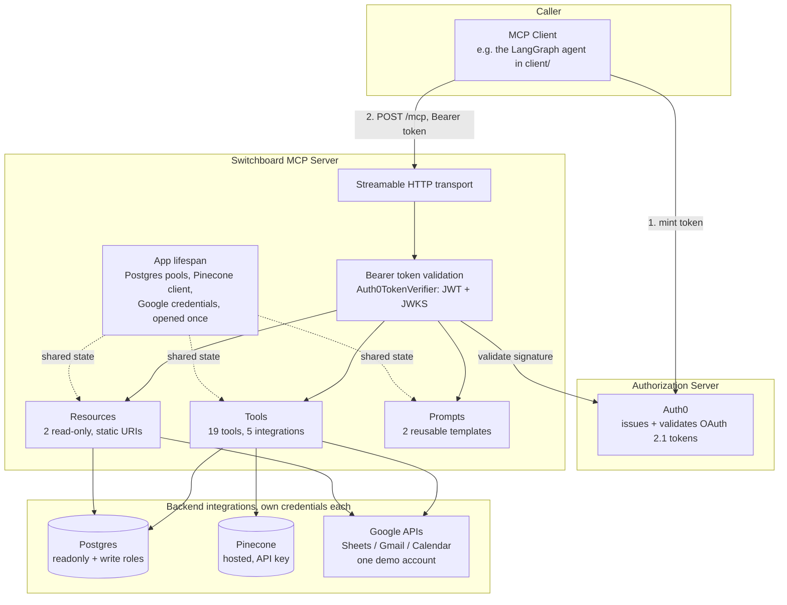

# Architecture

## Overview

Switchboard is a single Python process exposing an MCP server (FastMCP, from the official `mcp` SDK) over Streamable HTTP. It sits in front of five backend integrations and holds no state of its own beyond a handful of long-lived connections opened once at startup.

## Two auth layers, kept deliberately separate

This is the single most important architectural decision in the project, and it's easy to conflate the two if you're not looking for the distinction:

1. **MCP-level auth** — who is allowed to call this server at all. Auth0 issues OAuth 2.1 access tokens; `Auth0TokenVerifier` (`auth/token_validation.py`) validates them locally against Auth0's public JWKS, entirely statelessly — no session store, no call back to Auth0 on every request.
2. **Backend integration credentials** — how the server itself talks to Postgres, Pinecone, and Google on a caller's behalf. These never touch the MCP-level auth layer. Postgres and Pinecone use scoped service credentials; Google uses one dedicated demo account's OAuth tokens rather than per-caller delegation.

A caller with a perfectly valid Auth0 token never sees, and the server process never exposes, the Postgres admin superuser credentials, the Pinecone key, or the Google refresh token directly — those live only inside `core/config.py`'s `Settings` and the connection objects built from it in `core/lifespan.py`.

## Request lifecycle

1. A client (e.g. `client/agent.py`) mints an Auth0 access token via the client-credentials grant, using the same M2M application throughout the project.
2. The client connects over Streamable HTTP with that token as a Bearer header.
3. The MCP SDK's auth middleware validates the token before any tool, resource, or prompt handler runs — `Auth0TokenVerifier.verify_token()` checks the JWT signature (via JWKS), issuer, audience (RFC 8707 resource indicator), expiry, and required scope.
4. A validated request reaches the relevant handler, which reads shared, process-lifetime state (connection pools, the Pinecone client, Google credentials) from the `AppContext` built once at startup — see `core/lifespan.py`.
5. The handler does its work and its own defense-in-depth checks (see below), then returns.

## Defense in depth on the Postgres path

Three independent layers protect the database, on purpose — not because any one of them is insufficient alone, but because each one closes a different class of mistake:

1. **Parameterized queries, enforced in code.** Every Postgres call goes through `asyncpg`'s native `$1, $2, ...` binding. This codebase never builds SQL by string-formatting a caller-supplied value into a query.
2. **Least-privilege database roles.** The read path (`query_database`, `list_tables`, `describe_table`) runs under a Postgres role with `SELECT` only — no write grant exists anywhere for that role. `execute_write` runs under a separate role scoped to DML only, with no DDL rights, so even a fully compromised write path can't drop a table.
3. **Statement-shape validation** (`security/sql_guard.py`). Even fully parameterized, syntactically valid SQL is rejected if it isn't the expected shape — a `SELECT` sent to `query_database` where a `DROP` sneaks in, or a second statement stacked onto a first via a semicolon. Implemented with real SQL parsing (`sqlparse`), not regex/keyword matching against raw text, which is the kind of check that's trivially bypassed with a comment or a case change.

## MCP primitives used

- **Tools** (19 across the 5 integrations, plus `ping`/`whoami` for connectivity and auth verification) — every one carries explicit annotations. Four distinct annotation profiles are used, not just "read-only vs. not": read-only, destructive-and-idempotent (e.g. `delete_vectors` — deleting an already-deleted id is a no-op), destructive-and-non-idempotent (e.g. `execute_write`, `send_email` — running twice does the thing twice), and data-modifying-but-not-destructive (e.g. `upsert_documents`, `append_row`).
- **Resources** — `switchboard://postgres/schema` and `switchboard://calendar/upcoming`. Static URIs, no caller-supplied arguments, meant as always-available ambient context rather than a parameterized query.
- **Prompts** — `draft_follow_up_email` and `summarize_week_events`. The latter is async and fetches real calendar data to embed in the template, rather than returning a generic instruction with nothing to work from.

## Lessons from the build

A few real issues surfaced only by actually running the code, not by reading documentation — worth recording rather than letting them fade from memory:

- **`switchboard` needs to be an installed package, not a loose script.** Running `python src/switchboard/server.py` directly only puts `src/switchboard/` on `sys.path`, not `src/` — internal absolute imports like `from switchboard.auth.scopes import ...` fail. Fixed with `pyproject.toml` + `pip install -e .` (locally) / `pip install .` (in the Docker image), and the entrypoint changed to `python -m switchboard.server`.
- **A confirmed upstream SDK bug**: an MCP Resource with a static (non-templated) URI can't take a `ctx: Context` parameter in the pinned SDK version — the decorator's URI-parameter-matching validation incorrectly rejects it (`modelcontextprotocol/servers#1463`). Worked around with a module-level `get_app_context()` accessor in `core/lifespan.py` instead of parameter injection, since every resource here only ever needs the one shared, process-lifetime `AppContext` anyway.
- **The Pinecone SDK's `indexes.list()` changed whether it's a coroutine between versions** — the pinned version (9.1.0) needs `await`, contradicting the newer async-iterator style shown in current docs.
- **`langchain-mcp-adapters==0.2.1` doesn't declare a tight enough `mcp` version bound.** Left unpinned, pip resolves `mcp` v2.x, which that adapter version breaks against with an `ImportError`. The client's `requirements.txt` pins `mcp==1.12.0` explicitly to force the same stable v1.x line the server itself uses.
- **`langgraph.prebuilt.create_react_agent`, despite being the officially deprecated path, still needs the base `langchain` package installed** for its internal "provider:model" string resolution — it does not avoid that dependency the way you'd assume from being the "lighter" legacy API.
